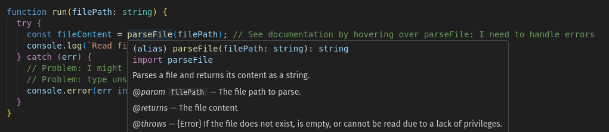

# A Small Lecture on Error Handling in TypeScript

... for software engineers who are not familiar with the weird type system of TypeScript ;-)

In this article, we will move through different major stages of error handling capabilities:
1. No error handling at all
2. Forcing clients to handle error cases
3. Additionally, allow clients to easily identify different error scenarios

For each of the different stages, we provide example code linked at the bottom of each section.
To execute examples, please navigate to the `examples` directory, download dependencies via `npm i`, and execute the example via `npm run start:x` (where 1 <= x <= 6).

## 1. The Running Example

For demonstration purposes, we will look at a minimal example on how to handle errors.
The idea is to simply read a file from the file system and to output it's file size:

```javascript
import { parseFile } from "./01-parse.js";

function run(filePath: string) {
  const fileContent = parseFile(filePath);
  console.log(`Read file: ${fileContent.length}`);
}

run("./file.txt");
```

The implementation of the `parseFile` function raises some errors in cases where the file does not exist or the user does not have read privileges to access the file. 
In our scenario, the case of having no access indicates a bug in the system, which means the system cannot recover (and should potentially fail fast).
This is a naive implementation we will start with and adapt during the course of this article to make error handling more mature.

```javascript
import fs from "node:fs"

export function parseFile(filePath: string): string {
  if (!fs.existsSync(filePath)) {
    // Recoverable error: client should handle it.
    throw new Error(`The file at ${filePath} does not exist.`);
  }

  try {
    fs.accessSync(filePath, fs.constants.R_OK);
  } catch (err) {
    // Indicates a bug: client should let the program crash.
    throw new Error(`The file at ${filePath} cannot be read. Contact support.`);
  }
  
  const content = fs.readFileSync(filePath, "utf-8");
  return content;
}
```

The **initial problem** is that client might be **not aware** that the function can raise errors in the first place.
That is a common issue in TypeScript since errors are not part of the method signature like in other languages (e.g., Java).

Please find the code for this example [here](examples/01-no-error-signature.ts).


## 2. Documentation as the fix?

As a very naive way, the developer of the `parseFile` function can add documentation to indicate to clients that some exceptions can be raised.
JSdoc offers a `@throws` tag to indicate what kind of things might be thrown by a function.

```js
/**
 * Parses a file and returns its content as a string.
 * @param filePath The file path to parse.
 * @returns The file content
 * @throws {Error} If the file does not exist, is empty, or cannot be read due to a lack of privileges.
 */
export function parseFile(filePath: string): string { ... }
```


As a result, clients can see the documentation when hovering over the function.
Still, it is **easy to forget** to look at the documentation, leaving to the same problem like before: forgetting to handle the error.
Instead, we want to enforce the client to handle the errors.


